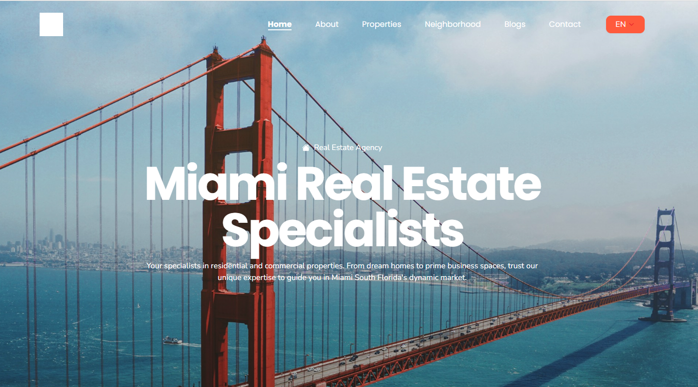

```markdown
# Real Estate Website

This is a simple real estate website built with Next.js. It showcases available properties, with features like browsing listings, viewing property details, and a search filter to make the experience more intuitive.
## Features

- **Property Listings**: Displays a list of real estate properties with basic details like price, location, and image.
- **Property Details**: Users can click on a listing to view more details about a specific property, including more images and descriptions.
- **Search Functionality**: Users can filter properties by location, price range, and type.
- **Responsive Design**: Fully responsive design that works seamlessly on both desktop and mobile devices.
- **SEO Optimized**: Built with Next.js to ensure SEO optimization for better search engine visibility.

## Technologies Used

- **Next.js**: A React framework used for building the website with server-side rendering (SSR).
- **React**: A JavaScript library for building user interfaces.
- **CSS/SCSS**: For styling and layout.
- **TailwindCSS**: Utility-first CSS framework for faster and easier design.

## Getting Started

To get a local copy up and running, follow these simple steps.

### Prerequisites

- Make sure you have Node.js installed on your machine.
- Install [Yarn](https://yarnpkg.com/) or use npm as your package manager.

### Installation

1. Clone the repository:
    ```bash
   git clone https://github.com/nurmohammadapu/Typetech-IT-Task.git
   cd Typetech-IT-Task

    ```

2. Install the dependencies:
    ```bash
    npm install
    # or
    yarn install
    ```

3. Run the development server:
    ```bash
    npm run dev
    # or
    yarn dev
    ```

4. Open your browser and visit `http://localhost:3000` to see the website in action.

## Screenshots



## Contributing

Feel free to fork this repository, open issues, and submit pull requests. Contributions are always welcome!

## License

This project is licensed under the MIT License.


